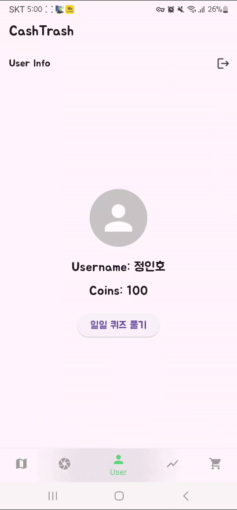
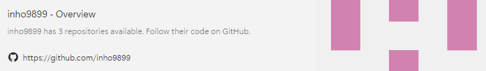
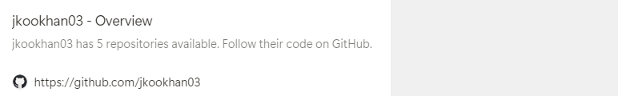
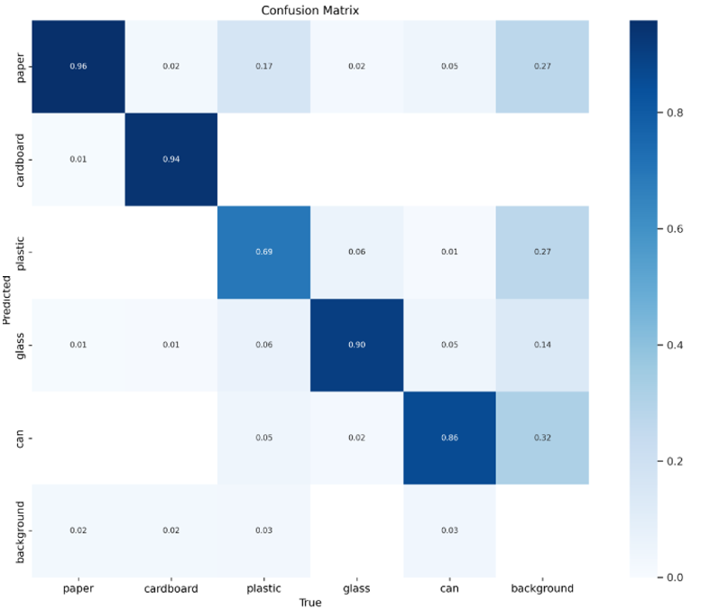
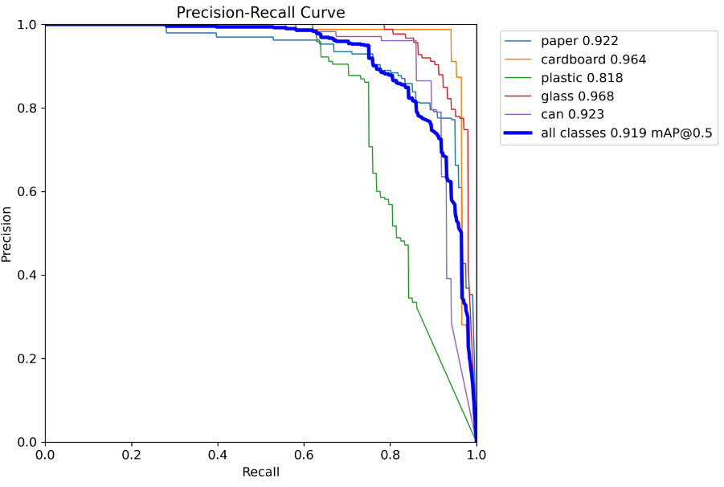
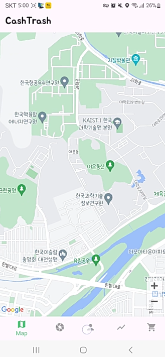
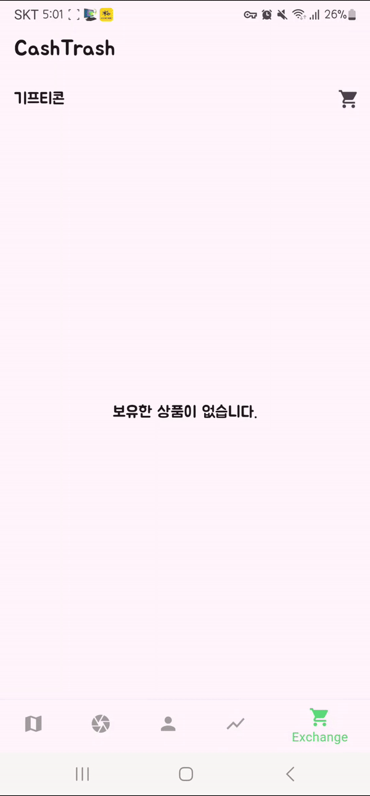

# madcamp_week3

# Preview

<table>
  <tr>
    <td></td>
    <td></td>
    <td></td>
  </tr>
</table>

# Team

1. [정인호](https://www.notion.so/madcamp/f51fae3248a747fcb3100942d2a666f9?pvs=4)
<br>

    [](https://github.com/inho9899)


<br>


2. [한종국](https://www.notion.so/madcamp/2eb9c9155ca34971bde955093a1eb8b2?pvs=4)
<br>

    [](https://github.com/jkookhan03)


<br>

# Tech Stack

- **Front-end** : Flutter
- **Back-end**: Node.js
- **Database**: MySQL
- **Server**: KCloud
- **IDE**: Android Studio & Vscode
- **Design**: Figma
- **SDK**: Kakao, Naver
- **Object Detection Model** : YOLOv5

# Details

## Object Detection Model : YOLO(You Only Look Once) Model

YOLO(You Only Look Once) 모델은 실시간 객체 탐지를 위한 딥러닝 기반 알고리즘이다.

YOLO는 이미지 내 객체를 한 번의 신경망 전달만으로 탐지하는 혁신적인 접근 방식을 취한다.

이러한 특성으로 객체 탐지에서 높은 속도와 정확도를 제공한다.

💯 **기본 원리** 💯

YOLO는 이미지를 격자로 나누고, 각 격자 셀에서 객체가 존재할 확률과 해당 객체의 경계 상자(bounding box)를 예측한다. 각 격자 셀은 특정 클래스에 속할 확률과 박스의 좌표를 동시에 출력한다.

1. **격자 분할**: 입력 이미지를 S×S 격자로 분할한다.
2. **경계 상자 예측**: 각 격자 셀은 B개의 경계 상자와 각 상자의 신뢰도(confidence)를 예측한다. 신뢰도는 그 상자가 객체를 포함할 확률과 상자의 정확도를 모두 반영한다.
3. **클래스 확률**: 각 격자 셀은 C개의 클래스에 대한 확률을 예측한다.
4. **최종 출력**: 각 상자의 신뢰도와 클래스 확률을 곱하여 최종적으로 객체의 존재 확률을 계산한다.


⇒ Detection을 빠른 시간 안에 처리해준다는 장점을 이용하기 위해서 이 모델을 사용하기로 결정하였다.

### YOLOv5 model

[GitHub - ultralytics/yolov5: YOLOv5 🚀 in PyTorch > ONNX > CoreML > TFLite](https://github.com/ultralytics/yolov5)

YOLO 모델은 시간에 걸쳐 다양한 version을 제공한다. 그 중에서 YOLOv5 모델은 PyTorch로 구현되어 사용성과 확장성을 높인 버전이다. python 접근성도 용이하고 gpu를 사용할 수 있는 환경이 제공되어있기 때문에 다음 모델을 채택하기로 하였다.

### Datasets

[GitHub - garythung/trashnet: Dataset of images of trash; Torch-based CNN for garbage image classification](https://github.com/garythung/trashnet)

쓰레기 분리수거 항목 detection을 위해서 쓰레기 image dataset을 사용하였다. 

- 학습에 사용한 데이터는 아래와 같다.

<aside>
💡 **paper** : 594개
**cardboard** : 403개
**plastic** : 482개
**glass** : 501개
**can** : 410개

</aside>

### Training

**(#TrainingSet ) : (#ValidationSet) = 4 : 1** 의 비율을 최대한 맞추어 각각의 class에 대해서 training을 진행하였다.

<aside>
💡 **paper** : 480개(Train) + 114개(Validation)
**cardboard** : 320개(Train) + 83개(Validation)
**plastic** : 382개(Train) + 100개(Validation)
**glass** : 400개(Train) + 101개(Validation)
**can** : 330개(Train) + 80개(Validation)

</aside>

디렉토리에서 다음과 같은 command를 입력해주면 학습이 training이 진행된다.

```makefile
python3 [train.py](http://train.py/) --img 512 --batch 16 --epochs 100 
--data dataset.yaml --weights [yolov5s.pt](http://yolov5s.pt/)
```


- Training 결과는 아래와 같다.





$$
let\ p := precision,\ r := recall\\
(F1\ score) = \frac{2pq}{(p+q)}
$$

- 다음 정의에 의해서 Precision-Recall Curve에서 우측 상단에 가까운 point가 F1 score가 가장 높게 가짐을 확인 할 수 있을 것이다.
- 이를 이용해서 각 class에서의 F1 score값의 maximum value를 구할 수 있으며, 90% 이상의 정확도를 가지는 것을 확인 할 수 있다.

### Detection

- 학습 중에 100 epoch에서 가장 정확도가 높았던 모델을(best.pt)로 저장시켜두었다.
- best.pt모델을 parameter로 사용하여 ‘detect.py’를 실행시킨다.


## 📱 기능 설명

### 로그인 화면


`LoginPage`는 사용자가 다양한 방법으로 로그인할 수 있는 화면이다. 사용자는 카카오톡, 네이버 계정으로 로그인하거나, 직접 아이디로 로그인할 수 있다. 로그인 정보는 서버로 전송되어 사용자의 등록 상태를 확인하고, 로그인 정보를 저장하여 이후에 사용할 수 있도록 했다.

1. **카카오톡 로그인 처리 : _loginWithKakao**
    
    **카카오톡 설치 여부 확인**: 카카오톡이 설치되어 있는지 확인하고, 설치되어 있으면 카카오톡으로 로그인 시도, 그렇지 않으면 카카오 계정으로 로그인 시도.
    
    **로그인 성공 후 사용자 정보 가져오기**: 로그인 성공 후 사용자 정보를 가져와서 프로필 이미지 URL과 사용자 ID를 추출.
    
    **사용자 등록 상태 확인**: 서버에 사용자 등록 상태를 확인하기 위해 사용자 ID와 로그인 방법을 전송하여 등록 여부 확인.
    
    **로그인 정보 저장 및 화면 전환**: 사용자가 등록된 경우 로그인 정보를 저장하고 홈 화면으로 전환, 등록되지 않은 경우 비밀번호 설정 화면으로 전환.
    
2. **네이버 로그인 처리 : _loginWithNaver**
    
    **네이버 로그인 시도**: 네이버 계정으로 로그인 시도.
    
    **로그인 성공 후 사용자 정보 가져오기**: 로그인 성공 후 사용자 정보를 가져와서 프로필 이미지 URL과 사용자 ID를 추출.
    
    **사용자 등록 상태 확인**: 서버에 사용자 등록 상태를 확인하기 위해 사용자 ID와 로그인 방법을 전송하여 등록 여부 확인.
    
    **로그인 정보 저장 및 화면 전환**: 사용자가 등록된 경우 로그인 정보를 저장하고 홈 화면으로 전환, 등록되지 않은 경우 비밀번호 설정 화면으로 전환.
    
3. **로그인 정보 저장 : _saveLoginInfo**
    
    **`SharedPreferences`에 로그인 정보 저장**: 로그인 방법, 사용자 토큰, 프로필 이미지 URL을 저장하여 이후에 자동 로그인에 사용할 수 있도록 했다.
    

### 쓰레기통 위치 표시 지도 화면(추후 업데이트 예정)

`GoogleMapScreen`은 Google Maps를 사용하여 지도 화면을 표시하는 화면이다. 이 화면에서는 지도의 특정 위치를 초기 중심점으로 설정하고, 사용자가 지도를 조작할 수 있도록 했다.

1. **지도 초기화 및 설정 : _onMapCreated**
    - 이 메서드는 `GoogleMapController`를 초기화하여 지도 조작을 가능하게 한다. `GoogleMapController`는 지도의 상태를 제어하고 조작할 수 있는 객체이다.
    - `GoogleMap` 위젯이 처음 생성될 때 호출되며, `GoogleMapController`를 저장하여 이후에 지도를 제어할 수 있도록 한다.
2. **중심 위치 설정 : _center**
    - `LatLng` 객체를 사용하여 지도의 초기 중심점을 설정한다. 현재 위치를 기반으로 중심점을 설정한다.
    


    

### 쓰레기 인식 카메라 화면

`CameraScreen`은 사용자가 사진을 찍고 서버에 업로드하여 사용자 정보를 업데이트할 수 있는 화면이다. 이 화면에서는 카메라를 초기화하고, 사진을 찍어 서버로 전송하며, 사진 업로드 후 사용자 정보(일일 쓰레기 정보와 코인)를 업데이트한다.

1. **카메라 초기화 : _initializeCamera**
    - 사용 가능한 카메라 목록을 가져오고, 첫 번째 카메라를 선택하여 `CameraController`를 초기화한다.
    - `CameraController`를 초기화하여 카메라 미리보기를 사용할 수 있도록 한다.
2. **사용자 ID 가져오기 : _getUserId**
    - 서버에 사용자의 토큰을 전송하여 사용자 ID를 가져온다.
    - HTTP POST 요청을 통해 서버에서 사용자 ID를 받아와 상태를 업데이트한다.
3. **사진 찍기 및 서버로 전송 : _takePictureAndSend**
    - 카메라가 초기화되고 사용자 ID가 존재하는 경우, 사진을 찍고 서버로 전송한다.
    - 사진을 찍은 후 `_sendImageToServer` 메서드를 호출하여 사진을 서버로 전송한다.
4. **사진 서버로 전송 : _sendImageToServer**
    - 사진을 서버로 업로드한다.
    - HTTP Multipart 요청을 통해 사진 파일을 서버로 전송하고, 업로드 결과를 처리한다.
    - 사진 업로드가 성공하면 일일 쓰레기 정보를 업데이트하고, 사용자 코인을 업데이트하는 요청을 서버에 보낸다.
5. **일일 쓰레기 정보 업데이트 : _updateDailyWaste**
    - 사진 업로드가 성공하면, 서버에 사용자 ID를 전송하여 일일 쓰레기 정보를 업데이트한다.
    - HTTP POST 요청을 통해 서버에서 일일 쓰레기 정보를 업데이트한다.
6. **사용자 코인 업데이트 : _updateUserCoins**
    - 사진 업로드가 성공하면, 서버에 사용자의 토큰과 추가할 코인 수를 전송하여 사용자 코인 정보를 업데이트한다.
    - HTTP POST 요청을 통해 서버에서 사용자 코인 정보를 업데이트한다.


### 유저 화면

`UserScreen`은 사용자의 프로필 정보를 보여주고, 일일 퀴즈를 통해 코인을 획득할 수 있는 화면이다. 이 화면은 사용자의 로그인 상태, 프로필 이미지, 이름, 현재 코인 수를 포함하며, 사용자는 일일 퀴즈를 통해 코인을 추가로 획득할 수 있다. 또한, 로그아웃 기능도 제공한다.

사용자가 로그인하면, `token`과 `profileImageUrl`, `loginMethod`와 같은 정보를 사용하여 서버에서 사용자 정보를 가져오고, 이를 화한다.

1. **사용자 정보 불러오기 : _fetchUserInfo**
    
    `_fetchUserInfo` 메서드는 사용자의 이름과 현재 코인 수를 서버로부터 가져와서 화면에 표시하는 기능을 한다. 이 메서드는 HTTP POST 요청을 통해 데이터를 받아오고, 상태를 업데이트하여 사용자 인터페이스에 반영한다.
    
2. **일일 퀴즈 날짜 확인 : _checkLastQuizDate**
    
    `_checkLastQuizDate` 메서드는 사용자가 마지막으로 퀴즈를 푼 날짜를 확인하여, 오늘 이미 퀴즈를 풀었는지 여부를 확인한다. 이 정보를 통해 사용자가 오늘 퀴즈를 다시 풀 수 있는지 여부를 결정한다.
    
3. **퀴즈 가져오기 : _fetchQuiz**
    
    `_fetchQuiz` 메서드는 서버로부터 퀴즈 데이터를 가져와서 화면에 표시하는 기능을 한다. 사용자가 퀴즈를 풀 수 있는 상태인지 확인한 후, HTTP GET 요청을 통해 퀴즈 데이터를 받아오고, 상태를 업데이트하여 퀴즈를 표시한다.
    
4. **퀴즈 정답 제출 : _submitAnswer**
    
    `_submitAnswer` 메서드는 사용자가 퀴즈 정답을 제출하고, 정답 여부를 확인하여 코인을 추가하는 기능을 한다. 정답일 경우, 서버에 코인 추가 요청을 보내고, 사용자 인터페이스에 반영한다. 또한, 퀴즈를 푼 날짜를 저장하여, 오늘 더 이상 퀴즈를 풀 수 없도록 설정한다.
    
5. **로그아웃 : _logout**
    
    `_logout` 메서드는 사용자가 로그아웃할 때 호출되며, `SharedPreferences`에 저장된 사용자 정보를 제거하여 완전히 로그아웃 상태로 만든다. 로그아웃 후 로그인 화면으로 전환된다.
    
    
    

### 쓰레기 통계 화면

`TimeSeriesChart`는 사용자가 최근 30일 동안 버린 쓰레기 양을 시각화하여 보여주는 화면이다. 이 화면은 사용자의 로그인 토큰을 사용하여 서버에서 데이터를 가져오고, 이를 그래프로 표시한다.

1. **사용자 ID 가져오기 : _fetchUserId**
    
    이 메서드는 사용자의 로그인 토큰을 서버에 전송하여 사용자 ID를 가져온다. HTTP POST 요청을 통해 서버에 토큰을 전송하고, 사용자 ID를 받아와 상태를 업데이트한다. 오류가 발생하면 오류 상태를 설정한다.
    
2. **데이터 가져오기 : _fetchData**
    
    이 메서드는 사용자의 사용자 ID를 사용하여 최근 30일 동안의 쓰레기 데이터를 서버에서 가져온다. HTTP GET 요청을 통해 데이터를 받아와 날짜별로 정리하고, 이를 그래프로 표시할 수 있는 형식으로 변환하여 상태를 업데이트한다. 오류가 발생하면 오류 상태를 설정한다.
    
3. **데이터 처리 및 그래프 설정**
    
    받아온 데이터를 처리하여 날짜별 쓰레기 양을 `FlSpot` 리스트로 변환하고, Y축 최대값과 간격을 설정한다. 이후 상태를 업데이트하여 그래프에 반영한다.
    
    
    

### 기프티콘 교환 화면

`ExchangeScreen`은 사용자가 보유한 코인으로 아이템을 구매하고, 구매한 아이템 목록을 확인할 수 있는 화면이다. 사용자의 로그인 토큰을 사용하여 서버에서 필요한 데이터를 가져오고, 이를 화면에 반영한한다.

1. **구매한 아이템 목록 가져오기 : _fetchPurchasedItems**
    
    이 메서드는 사용자의 로그인 토큰을 서버에 전송하여 사용자가 구매한 아이템 목록을 가져온다. HTTP POST 요청을 통해 서버에서 데이터를 받아와 상태를 업데이트하고, 화면에 구매한 아이템 목록을 표시한다. 오류가 발생하면 오류 메시지를 표시한다.
    
2. **사용자의 현재 코인 수 가져오기 : _fetchUserCoins**
    
    이 메서드는 사용자의 로그인 토큰을 서버에 전송하여 사용자의 현재 코인 수를 가져온다. HTTP POST 요청을 통해 서버에서 데이터를 받아와 상태를 업데이트하고, 화면에 현재 코인 수를 표시한다. 오류가 발생하면 오류 메시지를 표시한다.
    
3. **아이템 구매하기 : _purchaseItem**
    
    이 메서드는 사용자가 선택한 아이템을 구매하는 기능을 한다. 사용자의 현재 코인이 아이템 비용보다 적으면 오류 메시지를 표시하고 구매를 중단한다. HTTP POST 요청을 통해 서버에 구매 요청을 보내고, 구매가 성공하면 구매한 아이템 목록과 현재 코인 수를 업데이트한다. 오류가 발생하면 오류 메시지를 표시한다.
    
    
    

## API 명세서

### 서버 기본 정보

- 기본 URL: `http://172.10.7.88`
- 포트: 80

### 공통 응답 코드

- **200**: 성공
- **201**: 생성됨
- **400**: 잘못된 요청
- **403**: 접근 금지
- **404**: 찾을 수 없음
- **500**: 서버 오류

### CashTrash API 명세서

| 기능 | HTTP method | API path | Request | Response |
| --- | --- | --- | --- | --- |
| 사용자 확인 | POST | /checkUser | {<br>"login_method": "KAKAO" \| "NAVER",<br>"token_id": "string"<br>} | {<br>"status": "success" \| "failure",<br>"message": "사용자 정보 있음" \| "사용자 정보 없음" \| "잘못된 로그인 방법" \| "사용자 조회 오류"<br>} |
| 일반 로그인 사용자 확인 | POST | /checkUserNone | {<br>"token_id": "string",<br>"password": "string"<br>} | {<br>"status": "success" \| "failure",<br>"message": "사용자 정보 있음" \| "사용자 정보 없음" \| "사용자 조회 오류"<br>} |
| 사용자 등록 | POST | /registerUser | {<br>"name": "string",<br>"id": "string",<br>"password": "string",<br>"token_id": "string",<br>"token_type": "string"<br>} | {<br>"status": "success" \| "failure",<br>"message": "DB 업데이트 완료" \| "실행 오류"<br>} |
| 사용자 정보 조회 | POST | /getUserInfo | {<br>"token_id": "string"<br>} | {<br>"status": "success" \| "failure",<br>"message": "사용자 정보 있음" \| "사용자 정보 없음" \| "사용자 정보 조회 오류",<br>"data": {<br>"userName": "string",<br>"coin": "number"<br>}<br>} |
| 사용자 ID 조회 | POST | /getUserId | {<br>"token": "string"<br>} | {<br>"status": "success" \| "failure",<br>"message": "사용자 ID 조회 성공" \| "사용자 정보 없음" \| "데이터베이스 조회 오류",<br>"data": {<br>"userId": "number"<br>}<br>} |
| 퀴즈 조회 | GET | /getQuiz |  | {<br>"status": "success" \| "failure",<br>"message": "퀴즈 정보 있음" \| "퀴즈 정보 없음" \| "퀴즈 조회 오류",<br>"data": {<br>"id": "number",<br>"question": "string",<br>"answer": "string",<br>"options": ["string", "string", "string", "string"]<br>}<br>} |
| 사용자 코인 업데이트 | POST | /updateUserCoins | {<br>"token_id": "string",<br>"coins": "number"<br>} | {<br>"status": "success" \| "failure",<br>"message": "코인 업데이트 성공" \| "코인 업데이트 오류"<br>} |
| 사용자 코인 조회 | POST | /getUserCoins | {<br>"token_id": "string"<br>} | {<br>"status": "success" \| "failure",<br>"message": "코인 조회 성공" \| "사용자 정보 없음" \| "코인 조회 오류",<br>"data": {<br>"coins": "number"<br>}<br>} |
| 구매한 아이템 조회 | POST | /getPurchasedItems | {<br>"token_id": "string"<br>} | {<br>"status": "success" \| "failure",<br>"message": "구매한 아이템 조회 성공" \| "구매한 아이템 조회 오류",<br>"data": {<br>"items": ["string", "string", "string"]<br>}<br>} |
| 아이템 구매 | POST | /purchaseItem | {<br>"token_id": "string",<br>"item_name": "string",<br>"item_cost": "number"<br>} | {<br>"status": "success" \| "failure",<br>"message": "아이템 구매 성공" \| "사용자 정보 없음 또는 코인 부족" \| "트랜잭션 오류, 아이템 구매 오류, 코인 업데이트 오류"<br>} |
| 쓰레기 데이터 조회 | GET | /daily_waste |  | {<br>"status": "success" \| "failure",<br>"message": "낭비 데이터 조회 성공" \| "데이터 조회 오류",<br>"data": [<br>{<br>"date": "YYYY-MM-DD",<br>"amount": "number"<br>}<br>, ...<br>] |
| 쓰레기 데이터 업데이트 | POST | /updateDailyWaste | {<br>"user_id": "사용자의 고유 ID (정수형)"<br>} | {<br>"message": "daily_waste updated"<br>} |


## 데이터베이스 스키마


### 1. `users` 테이블

이 테이블은 사용자 정보를 저장한다.

- `id`: 각 사용자를 고유하게 식별하는 정수형 ID. 자동 증가(AUTO_INCREMENT)하며 기본 키(PRIMARY KEY)로 설정된다.
- `userName`: 사용자의 이름을 저장하는 문자열 필드. 비어 있을 수 없다.
- `following_user_id`: 팔로우하는 사용자의 ID를 저장하는 문자열 필드.
- `following_user_pw`: 팔로우하는 사용자의 비밀번호를 저장하는 문자열 필드.
- `login_method`: 로그인 방법을 저장하는 문자열 필드. 최대 5자.
- `login_token_id`: 로그인 토큰 ID를 저장하는 문자열 필드.
- `coin`: 사용자가 보유한 코인 수를 저장하는 정수형 필드.
- `createdAt`: 사용자가 생성된 날짜와 시간을 저장하는 타임스탬프 필드. 기본값은 현재 시간이다.

### 2. `quiz` 테이블

이 테이블은 퀴즈 질문과 답변 옵션을 저장한다.

- `id`: 각 퀴즈 질문을 고유하게 식별하는 정수형 ID. 자동 증가하며 기본 키로 설정된다.
- `question`: 퀴즈 질문을 저장하는 텍스트 필드. 비어 있을 수 없다.
- `option1`: 첫 번째 선택지를 저장하는 텍스트 필드. 비어 있을 수 없다.
- `option2`: 두 번째 선택지를 저장하는 텍스트 필드. 비어 있을 수 없다.
- `answer`: 정답을 저장하는 텍스트 필드. 비어 있을 수 없다.

### 3. `purchased_items` 테이블

이 테이블은 사용자가 구매한 아이템 정보를 저장한다.

- `id`: 각 구매 내역을 고유하게 식별하는 정수형 ID. 자동 증가하며 기본 키로 설정된다.
- `user_id`: 구매를 한 사용자의 ID를 저장하는 정수형 필드. `users` 테이블의 `id`를 참조하는 외래 키이다.
- `item_name`: 구매한 아이템의 이름을 저장하는 문자열 필드. 비어 있을 수 없다.

### 4. `daily_waste` 테이블

이 테이블은 사용자의 일일 쓰레기 배출량 정보를 저장한다.

- `id`: 각 기록을 고유하게 식별하는 정수형 ID. 자동 증가하며 기본 키로 설정된다.
- `user_id`: 해당 기록을 가진 사용자의 ID를 저장하는 정수형 필드. `users` 테이블의 `id`를 참조하는 외래 키이다.
- `date`: 쓰레기 배출이 기록된 날짜를 저장하는 날짜형 필드. 비어 있을 수 없다.
- `amount`: 배출된 쓰레기 양을 저장하는 정수형 필드. 비어 있을 수 없다.
